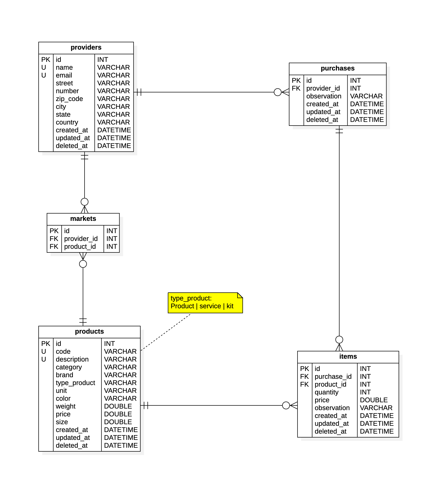

# Base de datos de Compras (YouTube)

Base de datos de ejemplo usado para canal de YouTube.

## Modelo entidad relación



## Script SQL

```sql

-- -------------------------------------------------
-- Database YouTubePurchase
-- -------------------------------------------------
DROP DATABASE IF EXISTS YouTubePurchase;
CREATE DATABASE IF NOT EXISTS YouTubePurchase;
USE YouTubePurchase;

-- -------------------------------------------------
-- Table providers
-- -------------------------------------------------
DROP TABLE IF EXISTS providers;
CREATE TABLE IF NOT EXISTS providers
(
  id           INT           NOT NULL  AUTO_INCREMENT,
  name         VARCHAR(255)  NOT NULL,
  email        VARCHAR(255)  NOT NULL,
  description  VARCHAR(255)      NULL  DEFAULT NULL,
  street       VARCHAR(255)      NULL  DEFAULT NULL,
  number       VARCHAR(20)       NULL  DEFAULT NULL,
  zip_code     VARCHAR(20)       NULL  DEFAULT NULL,
  city         VARCHAR(255)      NULL  DEFAULT NULL,
  state        VARCHAR(255)      NULL  DEFAULT NULL,
  country      VARCHAR(255)      NULL  DEFAULT NULL,
  created_at   DATETIME      NOT NULL  DEFAULT NOW(),
  updated_at   DATETIME          NULL  DEFAULT NULL,
  deleted_at   DATETIME          NULL  DEFAULT NULL,
  CONSTRAINT   pkProvider    PRIMARY KEY(id),
  CONSTRAINT   ukProvider    UNIQUE(name, email)
);

-- -------------------------------------------------
-- Table products
-- -------------------------------------------------
DROP TABLE IF EXISTS products;
CREATE TABLE IF NOT EXISTS products
(
  id            INT           NOT NULL  AUTO_INCREMENT,
  code          VARCHAR(65)   NOT NULL,
  description   VARCHAR(255)  NOT NULL,
  category      VARCHAR(255)      NULL  DEFAULT NULL,
  brand         VARCHAR(255)      NULL  DEFAULT NULL,
  type_product  VARCHAR(15)   NOT NULL  DEFAULT 'Product',
  unit          VARCHAR(65)   NOT NULL  DEFAULT 'Pieza',
  color         VARCHAR(65)       NULL  DEFAULT NULL,
  weight        DOUBLE            NULL  DEFAULT 0,
  price         DOUBLE            NULL  DEFAULT 0,
  size          DOUBLE            NULL  DEFAULT 0,
  created_at    DATETIME      NOT NULL  DEFAULT NOW(),
  updated_at    DATETIME          NULL  DEFAULT NULL,
  deleted_at    DATETIME          NULL  DEFAULT NULL,
  CONSTRAINT    pkProduct     PRIMARY KEY(id),
  CONSTRAINT    ukProduct     UNIQUE(code, description)
);

-- -------------------------------------------------
-- Table markets
-- -------------------------------------------------
DROP TABLE IF EXISTS markets;
CREATE TABLE IF NOT EXISTS markets
(
  id           INT  NOT NULL  AUTO_INCREMENT,
  provider_id  INT  NOT NULL,
  product_id   INT  NOT NULL,
  CONSTRAINT   pkMarket         PRIMARY KEY(id),
  CONSTRAINT   pkMarketProvider FOREIGN KEY(provider_id)
    REFERENCES providers(id),
  CONSTRAINT   pkMarketProduct  FOREIGN KEY(product_id)
    REFERENCES products(id)
);
-- -------------------------------------------------
-- Table purchase
-- -------------------------------------------------
DROP TABLE IF EXISTS purchases;
CREATE TABLE IF NOT EXISTS purchases
(
  id           INT           NOT NULL  AUTO_INCREMENT,
  provider_id  INT           NOT NULL  DEFAULT 1,
  observation  VARCHAR(255)      NULL  DEFAULT NULL,
  created_at   DATETIME      NOT NULL  DEFAULT NOW(),
  updated_at   DATETIME          NULL  DEFAULT NULL,
  deleted_at   DATETIME          NULL  DEFAULT NULL,
  CONSTRAINT   pkPurchase           PRIMARY KEY(id),
  CONSTRAINT   pkPurchaseProvider   FOREIGN KEY(provider_id)
    REFERENCES providers(id)
);

-- -------------------------------------------------
-- Table items
-- -------------------------------------------------
DROP TABLE IF EXISTS items;
CREATE TABLE IF NOT EXISTS items
(
  id            INT           NOT NULL  AUTO_INCREMENT,
  purchase_id   INT           NOT NULL  DEFAULT 1,
  product_id    INT           NOT NULL  DEFAULT 1,
  quantity      INT               NULL  DEFAULT 1,
  price         DOUBLE            NULL  DEFAULT 1,
  observation   VARCHAR(255)       NULL  DEFAULT NULL,
  created_at    DATETIME      NOT NULL  DEFAULT NOW(),
  updated_at    DATETIME          NULL  DEFAULT NULL,
  deleted_at    DATETIME          NULL  DEFAULT NULL,
  CONSTRAINT    pkItem            PRIMARY KEY(id),
  CONSTRAINT    pkItemProduct     FOREIGN KEY(product_id)
    REFERENCES  products(id),
  CONSTRAINT    pkItemPurchase    FOREIGN KEY(purchase_id)
    REFERENCES  purchases(id)
);

```
